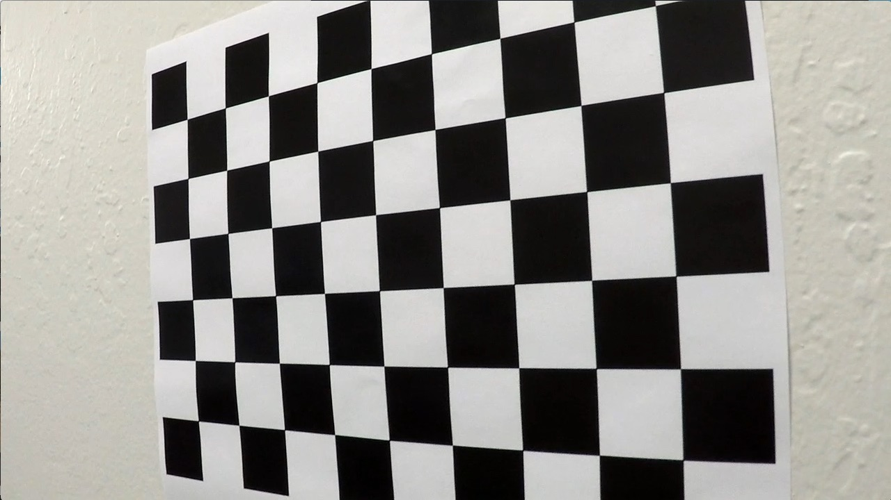
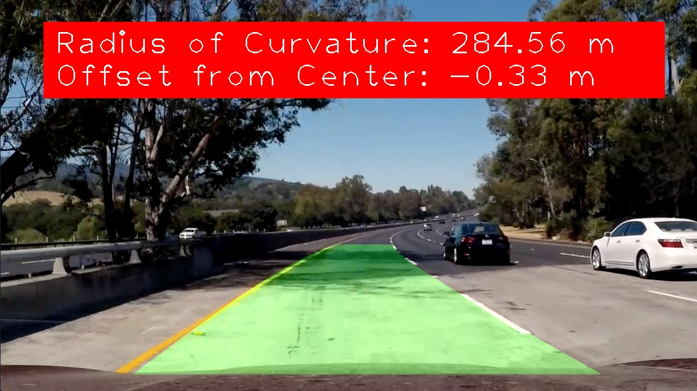
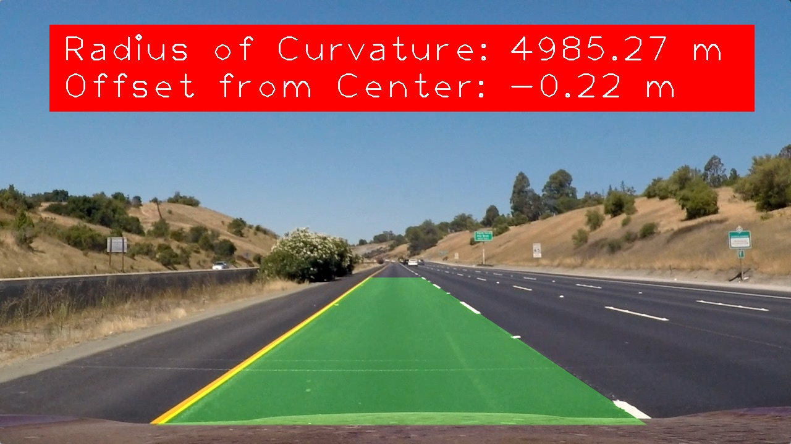

# AVND-P2-Advanced-Lane-Finding
Autonomous Vehicle Nano-Degree, Project 2: Using advanced computer vision to detect lane lines on a challenging stretch of highway. For video example see: https://github.com/PaulWarnick21/AVND-P2-Advanced-Lane-Finding/blob/master/test_videos_output/project_video_result.mp4

The following steps had to be taken in order to determine where the lane is infront of the vehicle:

## 1. Compute the camera calibration matrix and distortion coefficients given a set of chessboard images and apply a distortion correction to raw images.

## 2. Use color transforms, gradients, etc., to create a thresholded binary image.

## 3. Apply a perspective transform to rectify binary image ("birds-eye view") and detect lane pixels and fit to find the lane boundary.

## 4. Determine the curvature of the lane and vehicle position with respect to center, warp the detected lane boundaries back onto the original image and output visual display of the lane boundaries and numerical estimation of lane curvature and vehicle position.

